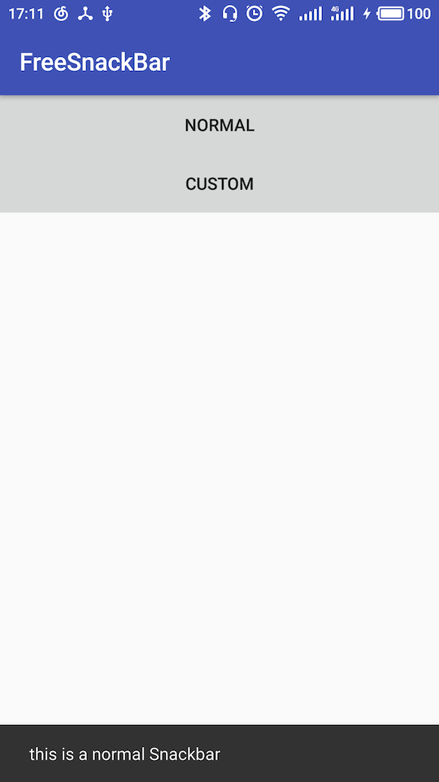
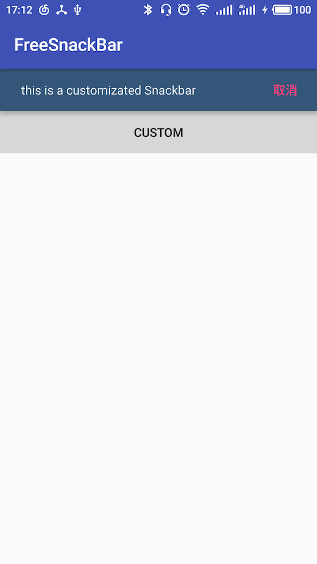

#FreeSnackBar

    模仿系统Snackbar实现的一个可控制Snackbar在顶部或者底部显示的控件
    
 ###Dependency
 
 Gradle
 
 ```
     compile 'com.jekyll.wu.widget:freesnackbar:1.0.5'
 ```
 
 Maven
 
 ```
 <dependency>
   <groupId>com.jekyll.wu.widget</groupId>
   <artifactId>freesnackbar</artifactId>
   <version>1.0.5</version>
   <type>pom</type>
 </dependency>
 ```

     

    
    默认情况下使用效果通系统API一样
    


    
    可以通过一些简单的api设置Snackbar显示的效果
    

```
    FreeSnackBar.make(btnTwo, "this is a customizated Snackbar", FreeSnackBar.LENGTH_INDEFINITE)
                            .top()//可选择top/bottom设置位置
                            .setBackgroundColor(Color.parseColor("#345678"))//设置背景色
                            .setActionTextColor(ContextCompat.getColor(getApplicationContext(), R.color.colorAccent))
                            .setAction("取消", new View.OnClickListener() {}));

```

###常用API

* top(）//设置展示位置顶部
* bottom(）//设置展示位置底部
* setBackgroundColor(）//设置背景色
* setBackgroundResource(）//设置背景
* setActionTextColor(）//设置action字体颜色
* setActionTextColor(）//设置action字体颜色
* setText(）//文本内容
* setDuration(）//显示时间


